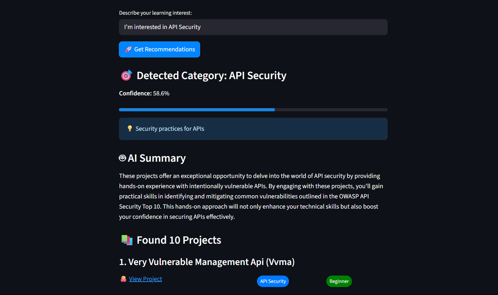
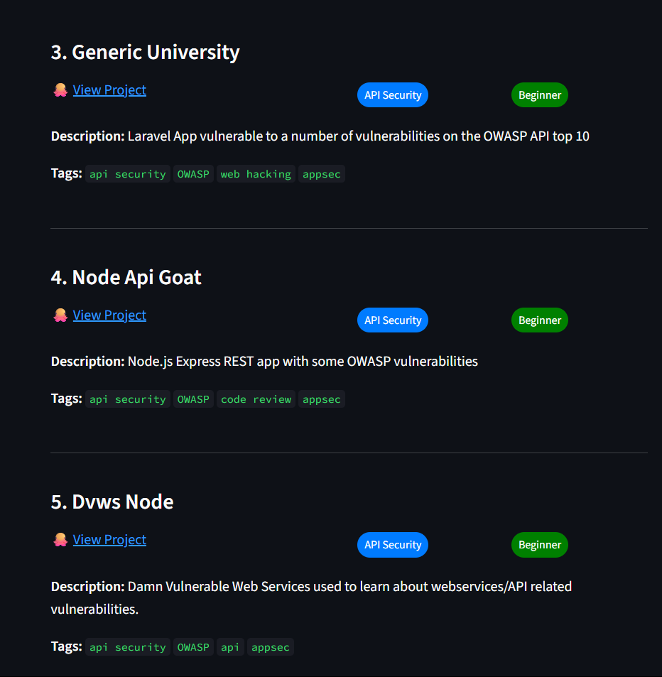

# 🛡️ HackList


> **Your AI-powered guide to hands-on cybersecurity learning!**

---

## 🚀 Features

- 🤖 **AI-Powered Recommendations**: Understands your interests and finds relevant projects
- 🔍 **Multi-Source Search**: Searches GitHub, OWASP, blogs, and educational platforms
- 📚 **Preloaded Dataset**: Curated cybersecurity projects for instant results
- 🏷️ **Smart Categorization**: Automatically sorts projects by security domain
- 🧹 **Duplicate Filtering**: Removes duplicates and irrelevant results
- 🖥️ **User-Friendly Interface**: Streamlit web app for easy interaction

---

## ⚡ Quick Start

### 🐳 Docker Installation (Recommended)

1. **Pull the image from Docker:**
```bash
docker pull abigaila11/hacklist:latest
```

2. **Set up environment variables:**
```bash
# Copy the example file to create your .env
cp env_example.txt .env

# Open .env and add your API keys
nano .env
```

3. **Run the container:**
```bash
docker run -p 8501:8501 --env-file .env abigaila11/hacklist:latest
```

4. **Open your browser:** [http://localhost:8501](http://localhost:8501)


### 🖥️ Local Installation
If you want to run the project locally (without Docker):

1. **Clone the repository:**
```bash
git clone https://github.com/abigailajohn/HackList
cd HackList
```

2. **Install dependencies:**
```bash
pip install -r requirements.txt
```

3. **Set up environment variables:**
```bash
# Copy the example file to create your .env
cp env_example.txt .env

# Open .env and add your API keys
nano .env
```

4. **Run the application:**
```bash
streamlit run app.py
```

### 🛠️ Setup Script

If you prefer an automated setup, run:

```bash
python setup.py
```
This script:
- ✅ Check Python version compatibility
- 📦 Install all dependencies
- 🔧 Create a .env file using the example template
- 🧪 Test core functionality
- 📋 Guide you on next steps

### Testing the Agent
Test the AI agent independently:
```bash
python test_agent.py
```
This will:
- 🤖 Initialize the AI agent
- 📂 Display available security categories
- 🧪 Test sample queries
- ✅ Verify functionality

---
## 🗂️ Project Structure

```
HackList/
├── app.py                    # 🖥️ Streamlit web interface
├── setup.py                  # 🛠️ Automated setup script
├── test_agent.py             # 🧪 Standalone agent testing
├── requirements.txt          # 📦 Python dependencies
├── Dockerfile               # 🐳 Container configuration
├── env_example.txt          # 🔧 Environment template
├── agent/                   # 🤖 AI Agent modules
│   ├── __init__.py
│   ├── core_agent.py        # Main AI agent logic
│   ├── search_tool.py       # Web search integration
│   ├── categorization.py    # Project categorization
│   └── filtering.py         # Result filtering
├── data/                    # 📚 Project datasets
│   ├── projects_dataset.json
│   └── categories.json
├── utils/                   # 🛠️ Utility functions
│   ├── __init__.py
│   └── helpers.py
└── images/                  # 🖼️ Documentation images
```


## 📖 Usage

1. **Open the web interface** at `http://localhost:8501`
2. **Enter your learning interest** (e.g., "I want to learn API security")
3. **Get personalized recommendations** with direct links to projects
4. **Browse by category** using the sidebar
5. **Adjust settings** like max results and web search

---
## 🖼️ Gallery

|  |  |  |
|:---:|:---:|:---:|
| _Describe your interest_ | _Get project recommendations_ | _Explore project details_ |

---

## 🛡️ Supported Security Domains

- 🌐 Web Security
- 🌐 API Security
- 🔗 Web3 Security
- 📱 Mobile Security
- 📡 IoT Security
- ☁️ Cloud Security
- 🤖 AI Security
- 🕵️‍♂️ Reverse Engineering
- 🦠 Malware Analysis
- 🕵️ Digital Forensics
- 🎭 Social Engineering
- 🐳 Container & Kubernetes Security
- 🔄 DevSecOps
- 🚨 Incident Response
- 🧩 Threat Modeling
- And more!

---

## 🤝 Contributing

We welcome contributions! You can help by:
- 📚 Adding new projects to the dataset
- 🧠 Improving categorization logic
- 🔍 Enhancing search functionality
- 🏷️ Adding new security domains
- 🐛 Reporting bugs or issues
- 📖 Improving documentation

---
## 📄 License

MIT License

---

*Made with ❤️ for the cybersecurity community!* 